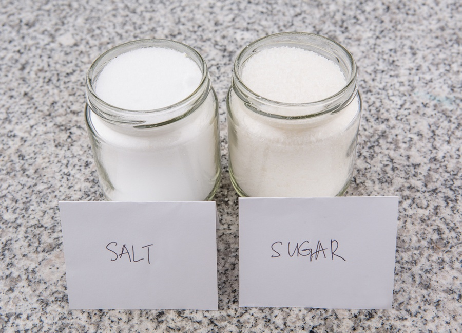

# The Stacktrace

## Maria Mckinley


## Let's make a fancy cake

#### Mocha Dacquoise


## Basic cake instructions:
* make meringue
* make buttercream
* make chantilly
* assemble


## Each step consists of more steps

### for example, 'make buttercream' consists of: <!-- .element: class="fragment" data-fragment-index="1" -->
* make syrup <!-- .element: class="fragment" data-fragment-index="2" -->
* whisk egg yolks <!-- .element: class="fragment" data-fragment-index="2" -->
* whisk syrup into egg yolks <!-- .element: class="fragment" data-fragment-index="2" -->


### and of course, 'make syrup' also has a couple of steps:
* In a high-sided saucepan over medium heat, add the coffee and sugar. 
* Set a candy or deep-fat thermometer into the pan and heat until the mixture registers 265&deg;F.


## Code is instructions for a computer
## like a recipe is instructions for a cook


## Let's say we are currently adding the sugar to make the syrup for the buttercream for the cake.


## Things we have started, but not yet completed:

* make cake
* make buttercream
* make syrup
* add sugar

## This is called the Stack<!-- .element: class="fragment" data-fragment-index="1" -->

#### 'make meringue' isn't there: we finished making it.<!-- .element: class="fragment" data-fragment-index="2" -->
#### 'make chantilly' isn't there: we haven't started making it.<!-- .element: class="fragment" data-fragment-index="3" -->


### What happens if something goes wrong while making the syrup? 




## The stack now shows us what we were doing when things went wrong

```
Traceback (most recent call last):
  File "make_cake.py", line 15, in <module>
    cake = make_cake(ingredients)
  File "make_cake.py", line 3, in make_cake
    buttercream=make_buttercream(syrup, egg_yolks)
  File "make_cake.py", line 9, in make_buttercream
    syrup=make_syrup(coffee, sugar) 
  File "make_cake.py", line 13, in make_syrup
    add_sugar(salt)
TypeError: salt is not sugar
```

## This is called the stacktrace <!-- .element: class="fragment" data-fragment-index="1" -->


### "make_cake(ingredients)"
### "make_buttercream(ingredients)"
### "make_syrup(coffee, sugar)"
### "add_sugar(salt)"


### Sometimes something goes wrong in a step that has already completed

```
Traceback (most recent call last):
  File "make_cake.py", line 15, in <module>
    cake = make_cake(ingredients)
  File "make_cake.py", line 3, in make_cake
    assemble_cake(meringue, buttercream, chantilly)
  File "make_cake.py", line 13, in assemble_cake
    spread_buttercream(buttercream)
AttributeError: buttercream too thin, slid off cake
```

### In this case, the error did not show up until after the step that caused it.


## This makes for more difficult troubleshooting for code, and sometimes cakes.


## The stack is a list of the steps we have started, but not completed so far.


## A stacktrace is the stack at the moment something has obviously gone wrong.
